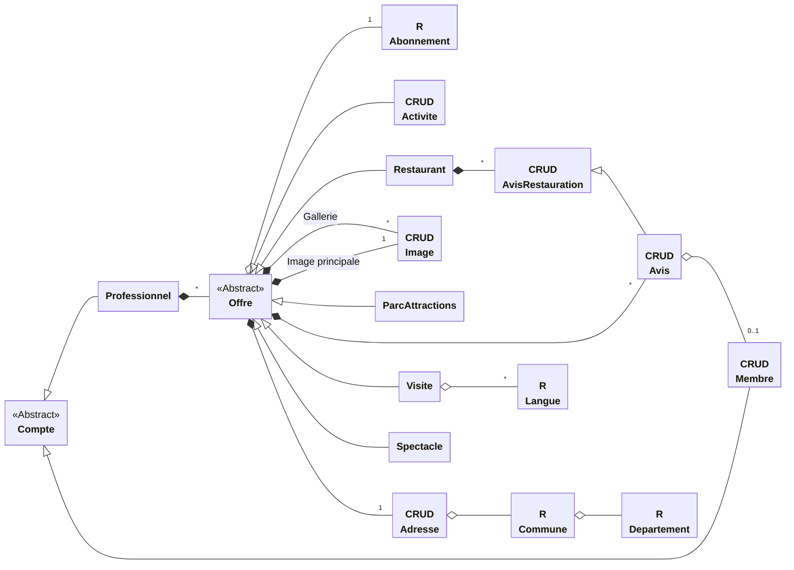

# Modèles et composants

Le système de composant de 413 est basé sur le principe suivant

> Créer quelquechose équivant à modifier **null**.

Ce principe nous permet de considérer l'opération de création (*Create*) et de modification (*Update*) uniformément, ce qui signifie qu'on a 2 fois moins de code à écrire.

Pour ce qui est du *Read* et *Delete*, elle seront implémentées aussi.

## Modèles

Un **modèle** encapsule une donnée et sa persistence dans la BDD. Il en existe 2 types :

- Une **valeur** encapsule une valeur scalaire, comme une durée, une date... Elle n'est pas associé à une table mais à un type de données. Elle peut être convertie en valeur SQL.
- Une **entité** encapsule une ligne d'une table dans la BDD. Elle peut être insérée, séléctionnée, mise à jour, supprimée, à l'aide d'un **identifiant**.

## Fichiers associés

Pour les valeurs : seulement une classe PHP

Pour les modèles :

- Une classe PHP
- Optionellement une feuille de style pour l'apparence
- Optionellement un module JS pour l'interactivité

## Graphe des dépendances

Graphes des dépendances d'aggrégations et de compostions entre les différents modèles.

## Valeurs

- FiniteTimestamp
- Time
- NonEmptyRange
- Multirange
