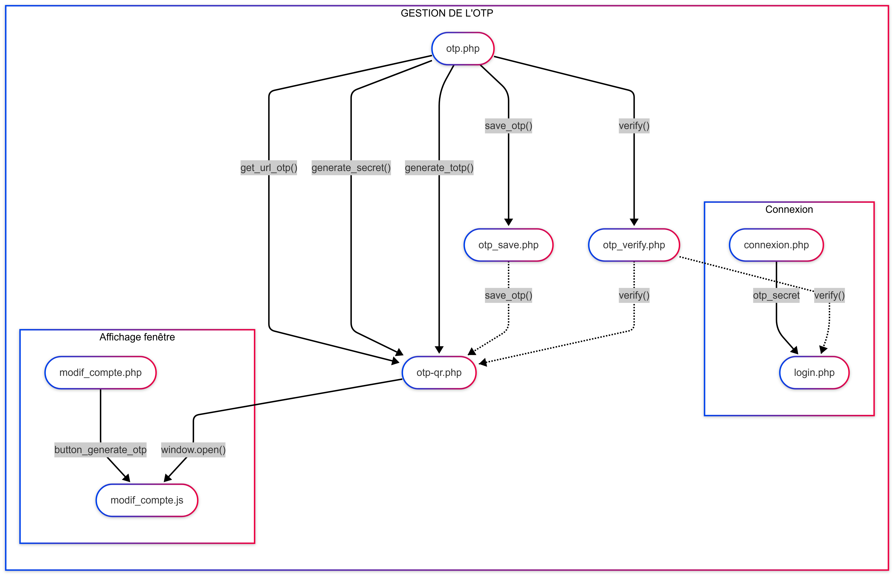

# Documentation otp équipe 413

### Sommaire
- [Rôle des fichiers](#Role_des_fichiers)
- [Description des fichiers](#Description_des_fichiers)
- [Graphe des intractions](#Graphe_des_intractions)
- [Vidéo](#Video)

## Rôle des fichiers 

[otp.php](#otp.php)
- Fichier au se trouve les fonctions de bases de l'otp : sauvegarde, génération du code qr, vérification du secret ...

[otp-qr.php](#otp-qr.php)
- Page qui affiche le qr code, qui s'assure que l'utilisateur est en possession du secret et qui déclenche la sauvegarde du secret dans la base de données.

[otp_verify.php](#otp_verify.php)
- Fichier qui permet l'appel en frontend de la fonction "verify()" du fichier otp.php dans otp-qr.php et login.php

[otp_save.php](#otp_save.php)
- Fichier qui permet l'appel en frontend de la fonction "save_otp()" du fichier otp.php dans otp-qr.php

[connexion.php](#connexion.php)
- Page de connection, sur cette page se trouve le champ "Code sécurisé".

[login.php](#login.php)
- Fichier qui assure la validité des informations de la connexion et qui connecte l'utilisateur.

[modif_compte.php](#modif_compte.php)
- Page qui affiche les détails d'un compte le bouton pour générer un code qr est sur cette page.

[modif_compte.js](#modif_compte.js)
- Fichier qui supervise les actions de modif_compte.php s'occupe de faire apparaître la page otp-qr.php

## Description des fichiers 

### otp.php 
#### Rôle principal :  
Bibliothèque centrale de gestion OTP (One-Time Password) basée sur TOTP.
#### Fonctions :
- **verify()** : vérifie un code OTP contre un secret avec une fenêtre de validité de 30 s.
- **save_otp()** : persiste le secret OTP en base de données pour un utilisateur.
- **generate_totp()** : crée un nouveau générateur TOTP avec paramètres par défaut.
- **generate_secret()** : Extrait le secret (base32) d'un objet TOTP
- **get_url_otp()** : génère l'URI standard pour les applications d'authentification.

### otp-qr.php 
#### Rôle principal :  
Interface visuelle d'activation OTP avec génération de QR Code.
#### Fonctions :
- Génère et affiche un QR Code scannable
- Fournis un formulaire de validation du premier code
- Communique avec `otp_verify.php` et `otp_save.php` en AJAX
- Ferme automatiquement la fenêtre après activation réussie ou après un abandon

### otp_verify.php 
#### Rôle principal :  
Endpoint API pour la vérification des codes OTP.
#### Fonctions :
- Reçois le code et le secret en POST.
- Utilise `OTP\verify()` pour la validation.
- Retourne une réponse binaire (1/0) au format texte.
- Gère le cas où le secret est déjà en base de données.

### otp_save.php 
#### Rôle principal :  
Endpoint API pour la persistance du secret OTP.
#### Fonctions :
- Utilise `OTP\save_otp()` pour la sauvegarde.

### connexion.php 
#### Rôle principal :  
Page de connexion principale avec intégration OTP.
#### Fonctions :
- Affiche le champ OTP conditionnellement.
- Gère les erreurs spécifiques OTP.
- Préserve l'URL de retour après authentification.
- Intègre le JavaScript pour la gestion dynamique du champ OTP.

### login.php 
#### Rôle principal :  
Traitement central de l'authentification.
#### Fonctions :

- Applique la vérification OTP si le secret existe.

### modif_compte.php 
#### Rôle principal :  
Interface de gestion des paramètres du compte.
#### Fonctions :
- Affiche le bouton d'activation OTP conditionnel.
- Intègre la popup d'activation via le JavaScript
- Bloque la modification si l'OTP est déjà activé.

### modif_compte.js 
#### Rôle principal :  
Gestion cotée client de l'activation OTP.
#### Fonctions :
- Ouvre la popup `otp-qr.php` dans une nouvelle fenêtre

- Communique avec les endpoints OTP via fetch API.

## Graphe des interactions 

## Vidéo 

[Vidéo : OTP équipe 413.](https://youtu.be/RT3qcZEA3Dw)